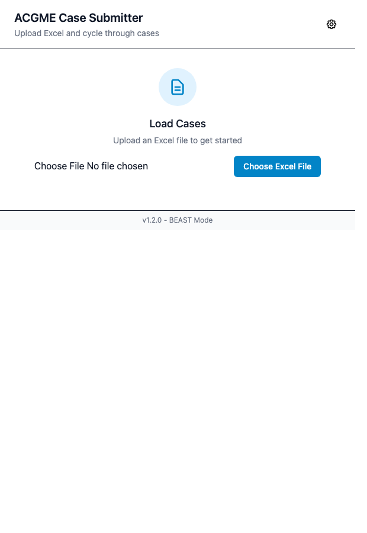
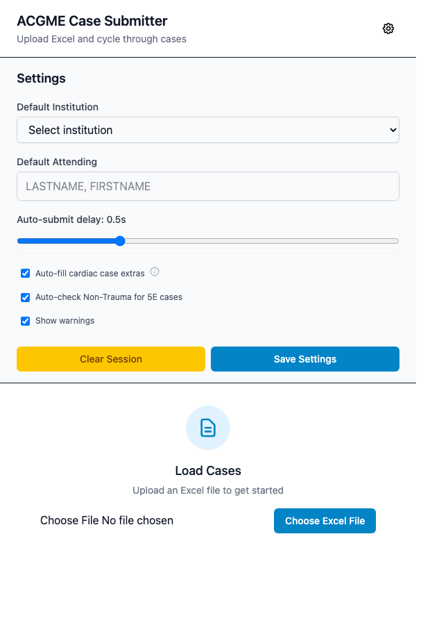
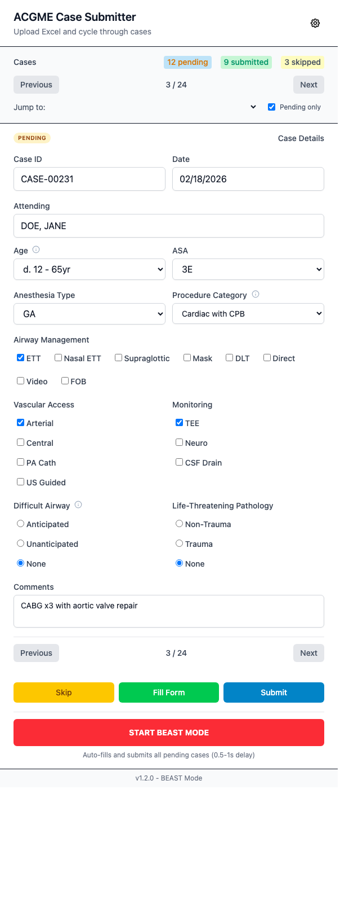

# Chrome Store Publishing and Usage Guide

Generated for the current codebase on **2026-02-20**.

## 1) What to submit to Chrome Web Store

### Build and package

```bash
npm run clean
npm run build
npm run package:zip
```

Upload:

- `acgme-case-submitter-v1.3.0.zip`

Source of truth for permissions and scopes:

- `manifest.json`
- `dist/manifest.json`

### Compliance language to include in listing/docs

Use explicit wording that this tool is for authorized users and is not
affiliated with ACGME.

Recommended text:

`This extension is an independent tool for authorized ADS users and is not affiliated with, endorsed by, or sponsored by ACGME.`

Do not claim universal legal compliance in listing text. Instead state intended
policy-aware use and user responsibility.

Canonical wording is maintained in `ACGME_COMPLIANCE.md`.

### Store listing requirements (current docs)

Required/expected in listing:

- Extension name and short summary
- Detailed description
- Category and language
- At least one screenshot (sizes accepted by CWS: `1280x800` or `640x400`)
- Contact/support email

Optional but recommended:

- Up to 5 screenshots total
- Promo images (small promo tile `440x280`, marquee promo tile `1400x560`)

Prepared `640x400` listing-ready screenshots in this repo:

- `assets/screenshots/store-01-upload-640x400.png`
- `assets/screenshots/store-02-settings-640x400.png`
- `assets/screenshots/store-03-review-640x400.png`
- `assets/screenshots/store-04-actions-640x400.png`

## 2) Single Purpose (copy/paste ready)

Chrome requires a narrow, easy-to-understand single purpose.

### Single purpose field (<=132 chars)

`For authorized ADS users: upload standardized case logs and fill ACGME Case Entry fields one case at a time.`

### Extended listing description starter

`ACGME Case Submitter imports standardized case-log spreadsheets (.xlsx/.xls/.csv), loads one case at a time in the popup, and fills matching fields on the ACGME Case Entry page for authorized users. It can optionally submit after fill, track pending/submitted/skipped status, and resume sessions from local browser storage. This extension is not affiliated with, endorsed by, or sponsored by ACGME.`

## 3) Permission Justifications (copy/paste ready)

Use these in **Privacy practices** permission justification fields.

### Host permission

Permission:

- `https://apps.acgme.org/ads/CaseLogs/CaseEntry/*`

Justification:

`This extension only works on the ACGME Case Entry page. It reads and updates form controls on that page to fill case details from the user-uploaded spreadsheet and optionally click Submit when the user chooses Fill+Submit or BEAST mode.`

Safer variant if you want extra compliance clarity:

`This extension only runs on the ACGME Case Entry page and is intended for authorized user-directed workflow automation in compliance with ACGME/ADS terms.`

### Storage permission

Permission:

- `storage`

Justification:

`Storage is used only to persist user settings (chrome.storage.sync) and current session progress/case state (chrome.storage.local) so users can continue where they left off.`

## 4) Privacy/Data Disclosure: practical answers you will need

Use this based on actual behavior in the repo (`PRIVACY.md`, `src/popup/storage.js`, `src/content/content.js`):

- Data sold: `No`
- Data shared with third parties: `No`
- External API calls/telemetry: `No`
- Data handling location: local browser only
- User controls: `Clear Session` button removes stored case/session state

Sensitive data question guidance:

- If uploaded files can include identifiable patient/health data, disclose this accordingly in CWS data disclosures and provide a privacy policy URL.
- If files are strictly de-identified training logs, disclose exactly that scope.

## 5) ACGME terms awareness checklist

Before enabling automation in production, confirm all of the following:

1. Users have authorized ADS account access.
2. Institution/program approves this workflow.
3. Usage aligns with:
   - `https://www.acgme.org/about/legal/terms-of-use`
   - `https://apps.acgme.org/ads/`
4. No scraping/mirroring/unauthorized access behavior is introduced.
5. Public docs keep the non-affiliation and no-legal-advice disclaimer.

## 6) Pre-submit technical checklist for this repo

1. Ensure build is fresh (`dist/` regenerated before zip).
2. Confirm permissions stayed minimal:
   - `storage`
   - host only `apps.acgme.org/ads/CaseLogs/CaseEntry/*`
3. Confirm no remote code / no telemetry claims remain true.
4. Align displayed version string in popup footer with manifest version:
   - footer currently shows `v1.2.0` in `src/popup/index.html`
   - manifest/package are `1.3.0`
5. Keep release notes aligned with `CHANGELOG.md`.

## 7) How to use the extension (with screenshots + file mapping)

### Step 1: Build and load unpacked extension

- Build via `npm run build`
- Open `chrome://extensions`
- Enable **Developer mode**
- Click **Load unpacked**
- Select `dist/`

Relevant files:

- `manifest.json`
- `BUILD.md`
- `README.md`

### Step 2: Prepare spreadsheet with required headers

Required headers are enforced at import:

- `Case ID`, `Case Date`, `Supervisor`, `Age`, `Original Procedure`, `ASA Physical Status`, `Anesthesia Type`, `Procedure Category`

Optional:

- `Airway Management`, `Specialized Vascular Access`, `Specialized Monitoring Techniques`

Relevant files:

- `INTERFACE.md`
- `src/popup/constants.js`
- `src/popup/excel.js`

### Step 3: Open popup and upload file

- Click extension icon
- Click **Choose Excel File**
- Select `.xlsx`, `.xls`, or `.csv`



What happens internally:

- Parse + column map: `src/popup/excel.js`
- Session state init: `src/popup/state.js`
- Persist state: `src/popup/storage.js`

### Step 4: Configure settings (optional but recommended)

- Open gear icon
- Set default institution / default attending
- Set auto-submit delay
- Toggle cardiac auto-fill, 5E pathology auto-check, warnings
- Click **Save Settings**



Relevant files:

- `SETTINGS.md`
- `src/popup/settings.js`
- `src/popup/state.js`

### Step 5: Review case details and navigate cases

- Use **Previous/Next** or **Jump to**
- Review/edit mapped fields before filling
- Track pending/submitted/skipped counters



Relevant files:

- `src/popup/form.js`
- `src/popup/navigation.js`
- `src/popup/ui.js`

### Step 6: Fill, submit, or skip

Actions:

- **Fill Form**: fill ACGME page only
- **Submit**: fill + submit (using configured delay)
- **Skip**: mark case skipped and move forward


Relevant files:

- Popup-to-content messaging: `src/popup/acgme.js`
- DOM filling/submitting on ACGME page: `src/content/content.js`

### Step 7: Bulk processing with BEAST mode

- Click **START BEAST MODE** to process all pending cases
- Pauses automatically on validation/submission failures
- Continue after manual correction

Relevant files:

- `src/popup/app.js` (BeastMode flow)
- `src/popup/form.js` (validation)

## 8) Source links for Chrome policy/docs used

- Program policies (single purpose): <https://developer.chrome.com/docs/webstore/program-policies/policies>
- Quality guidelines (single purpose clarity): <https://developer.chrome.com/docs/webstore/program-policies/quality-guidelines-faq>
- Publish flow / package upload: <https://developer.chrome.com/docs/webstore/publish>
- Store listing fields and assets: <https://developer.chrome.com/docs/webstore/cws-dashboard-listing>
- Privacy tab, single-purpose field, permission justifications: <https://developer.chrome.com/docs/webstore/cws-dashboard-privacy>
- Permission warning guidance: <https://developer.chrome.com/docs/extensions/develop/concepts/permission-warnings>
- Developer account registration fee ($5 one-time): <https://support.google.com/chrome_webstore/answer/187591>

## 9) Screenshot notes

Screenshots in `assets/screenshots/` were generated from the current popup UI build with representative sample values for documentation.
